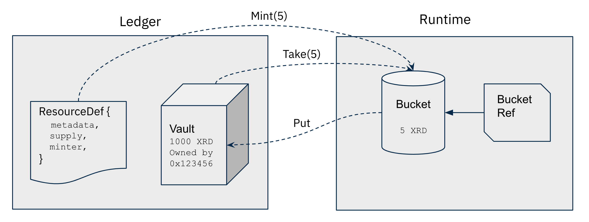

# Scrypto

[](https://github.com/radixdlt/radixdlt-scrypto/actions/workflows/ci.yml)

Language for building DeFi apps on Radix.

## Terminology

- **Package**: A collection of blueprints, compiled and published as a single unit.
- **Blueprint**: A template that describes the common behavior and structure of its instances.
- **Component** An instance of a blueprint, which lives in ledger state.
- **Function**: A set of statements to perform a specific task.
- **Method**: A function associated with a component.
- **ResourceDef**: The definition of a resource, including metadata, supply and mint auth.
- **Bucket**: A transient resource container.
- **Vault**: A persistent resource container in ledger state.



## Installation

1. Install Rust
   * Windows:
       * Download and install [`rustup-init.exe`](https://win.rustup.rs/x86_64)
       * Install "Desktop development with C++" with [Build Tools for Visual Studio 2019](https://visualstudio.microsoft.com/thank-you-downloading-visual-studio/?sku=BuildTools&rel=16)
   * Linux and macOS:
       ```
       curl --proto '=https' --tlsv1.2 -sSf https://sh.rustup.rs | sh
       ```
2. Enable `cargo` in the current shell:
   * Windows:
       * Start a new PowerShell
   * Linux and macOS:
       ```
       source $HOME/.cargo/env
       ```
3. Add WebAssembly target
    ```
    rustup target add wasm32-unknown-unknown
    ```
4. Install simulator
    ```
    git clone git@github.com:radixdlt/radixdlt-scrypto.git
    cd radixdlt-scrypto
    cargo install --path ./simulator
    ```
5. (Optional) Open Scrypto documentation for later use
    ```
    ./doc.sh
    ```

**Note:** For preview release, do not delete or move the repository after installation. It will be used when resolving dependencies of Scrypto packages.

## Getting Started

### Writing Scrypto Code

1. Start by creating a new package:
```
scrypto new-package <package_name>
cd <package_name>
```
2. Check out the files under your current directory:
  - Source code is within `src/lib.rs`;
  - Test code is within `tests/lib.rs`.
3. Build your package:
```
scrypto build
```
4. Run tests:
```
scrypto test
```

### Playing with Radix Engine

| Action | Command |
|---|---|
| To create an account | ``` resim new-account ``` |
| To change the default account | ``` resim set-default-account <account_address> ``` |
| To create a resource with fixed supply | ``` resim new-resource-fixed <amount> ``` |
| To create a resource with mutable supply | ``` resim new-resource-mutable ``` |
| To mint resource | ``` resim mint <amount> <resource_def>``` |
| To transfer resource | ``` resim transfer <amount> <resource_def> <recipient_address> ``` |
| To publish a package | ``` resim publish <path_to_package_dir_or_wasm_file> ``` |
| To call a function | ``` resim call-function <package_address> <blueprint_name> <function> <args> ``` |
| To call a method | ``` resim call-method <component_address> <method> <args> ``` |
| To export the ABI of a blueprint | ``` resim export-abi <package_address> <blueprint_name> ``` |
| To show info about an address | ``` resim show <address> ``` |

**Note:** The commands use the default account as transaction sender.

## Project Layout

- `sbor`: The binary data format used by Scrypto.
- `sbor-derive`: Derives for encoding and decoding Rust `struct` and `enum`.
- `scrypto`: Scrypto standard library.
- `scrypto-abi`: Scrypto blueprint ABI.
- `scrypto-derive`: Derives for defining and importing Scrypto blueprints.
- `radix-engine`: The Scrypto execution engine.
- `simulator`: A simulator that run Scrypto code on a filesystem based ledger.
- `examples`: Scrypto examples.
